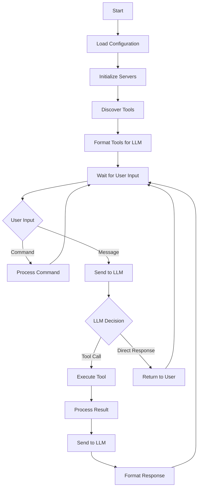

# MCP Chatbot

This chatbot example demonstrates how to integrate the Model Context Protocol (MCP) into a simple CLI chatbot. The implementation showcases MCP's flexibility by supporting multiple tools through MCP servers and is compatible with multiple LLM providers including Groq, OpenAI, Anthropic, Google (Gemini), OpenRoute, and Ollama.

## Key Features

- **Multi-Provider LLM Support**: 
  - Groq (Llama 3.2 models)
  - OpenAI (GPT models)
  - Anthropic (Claude models)
  - Google (Gemini models)
  - OpenRoute (Various models)
  - Ollama (Local models)
- **Dynamic Tool Integration**: Tools are declared in the system prompt, ensuring maximum compatibility across different LLMs.
- **Server Configuration**: Supports multiple MCP servers through a simple JSON configuration file.
- **Advanced Error Handling**: Implements circuit breaker pattern and retry mechanisms for robust operation.
- **Health Monitoring**: Continuous health checks for LLM providers and servers.
- **Async Implementation**: Built with asyncio for efficient concurrent operations.

## Requirements

- Python 3.10+
- Required packages:
  - `python-dotenv`
  - `aiohttp`
  - `mcp`
  - `uvicorn`
  - `google-generativeai` (for Gemini support)

## Installation

1. **Clone the repository:**

   ```bash
   git clone https://github.com/XXX
   cd mcp-chatbot
   ```

2. **Install the dependencies:**

   ```bash
   pip install -r requirements.txt
   ```

3. **Set up environment variables:**

   Create a `.env` file in the root directory and add your API keys:

   ```plaintext
   GROQ_API_KEY=your_groq_api_key
   OPENAI_API_KEY=your_openai_api_key
   ANTHROPIC_API_KEY=your_anthropic_api_key
   GEMINI_API_KEY=your_gemini_api_key
   OPENROUTE_API_KEY=your_openroute_api_key
   GITHUB_API_KEY=your_github_api_key
   
   # Optional configuration
   DEFAULT_LLM_PROVIDER=groq
   DEFAULT_LLM_MODEL=llama-3.2-90b-vision-preview
   ```

4. **Configure servers:**

   The `servers_config.json` follows a simple structure for configuring multiple MCP servers:

   ```json
   {
     "mcpServers": {
       "sqlite": {
         "command": "uvx",
         "args": ["mcp-server-sqlite", "--db-path", "./test.db"]
       },
       "puppeteer": {
         "command": "npx",
         "args": ["-y", "@modelcontextprotocol/server-puppeteer"]
       }
     }
   }
   ```

   Environment variables can be passed to servers:
   ```json
   {
     "mcpServers": {
       "server_name": {
         "command": "uvx",
         "args": ["mcp-server-name", "--additional-args"],
         "env": {
           "API_KEY": "your_api_key_here"
         }
       }
     }
   }
   ```

## Usage

1. **Run the client:**

   ```bash
   python main.py
   ```

2. **Available Commands:**
   - `/llm` - Show available LLM providers and models
   - `/switch <provider> <model>` - Switch to a different LLM provider/model
   - `/refresh` - Refresh model lists for all providers
   - `/help` - Show help message
   - `quit` or `exit` - Exit the chat

3. **Interact with the assistant:**
   
   The assistant will automatically detect available tools and can respond to queries based on the tools provided by the configured servers.

## Architecture

### Class Structure

- **Configuration**: Manages environment variables, API keys, and server settings
- **Server**: Handles MCP server lifecycle, tool discovery, and execution with error handling
- **Tool**: Represents individual tools with their properties and formatting
- **LLMClient**: Manages communication with multiple LLM providers
- **ChatSession**: Orchestrates the interaction between user, LLM, and tools
- **CircuitBreaker**: Implements circuit breaker pattern for fault tolerance
- **AsyncRetry**: Handles asynchronous retry logic with exponential backoff

### Key Components

1. **LLM Provider Management**:
   - Dynamic provider switching
   - Automatic model discovery
   - Health monitoring and failover
   - Connection pooling and timeout handling

2. **Server Management**:
   - Asynchronous server initialization
   - Automatic tool discovery
   - Health checks and reconnection logic
   - Graceful cleanup on shutdown

3. **Error Handling**:
   - Circuit breaker pattern for fault isolation
   - Exponential backoff retry mechanism
   - Automatic failover to healthy providers
   - Comprehensive error logging

4. **Performance Features**:
   - Asynchronous operations with asyncio
   - Connection pooling for HTTP requests
   - Periodic model list refresh
   - Efficient message queue processing

### Logic Flow



## Contributing

Contributions are welcome! Please feel free to submit a Pull Request.

## License

This project is licensed under the MIT License - see the LICENSE file for details.

